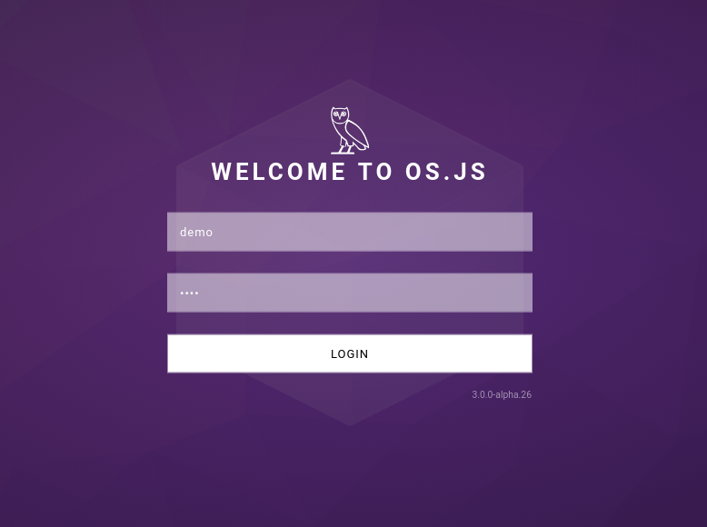

# Customizing Login Guide

You can customize the login screen both visually and functionally.

You can also [replace it entirely](#replace) by providing your own adapter.


## Basics

In your client configuration (`src/client/config.js`) you can override certain aspects of the login:

```json
{
  auth: {
    ui: {
      title: "Welcome to Company",
      stamp: "custom-build version 1234"
    }
  }
}
```

## Adding fields

You can set your own fields:

```json
{
  auth: {
    ui: {
      fields: [{
        tagName: "input",
        attributes: {
          name: "username",
          type: "text",
          placeholder: "Username"
        }
      }, {
        tagName: "input",
        attributes: {
          name: "password",
          type: "password",
          placeholder: "Password"
        }
      }, {
        tagName: "select",
        attributes: {
          name: "provider"
        },
        choices: [{
          value: "company-1",
          label: "Company 1"
       }, {
          value: "company-2",
          label: "Company 2"
       }]
      }, {
        tagName: "input",
        attributes: {
          type: "submit",
          value: "Login"
        }
      }]
    }
  }
}
```

## Customizing styles

By default the login container uses the DOM id `#meeseOS-login`, which you can override in your configuration:

```json
{
  auth: {
    ui: {
      id: "custom-meeseOS-login"
    }
  }
}
```

You can now add your own styles to `src/client/index.scss`.

## Logo

You can also add a logo via configuration and customize via CSS:



```javascript
import logo from "../logo.png";

{
  auth: {
    ui: {
      logo: {
        position: "top", // top, bottom, left, right
        src: logo
      }
    }
  }
}
```

```css
.meeseOS-login-logo {
 /* Your style here */
}
```

## Replace

You can also replace the default UI with your own:

> Note that you can use your `src/client/index.html` file to add HTML content instead of programmatically adding via DOM.

### Adapter

Extend the default adapter in for example `src/client/custom-login.js`:

```javascript
import { Login } from "@meeseOS/client";

export default class MyCustomLogin extends Login {
  render() {
    // Set a custom class name
    this.$container.className = "my-custom-login";

    // Add your HTML content
    this.$container.innerHTML = "Put your content here";

    // Bind the events
    this.on("login:start", () => console.log("Currently trying to log in..."));
    this.on("login:stop", () => console.log("Login was aborted or stopped"));
    this.on("login:error", err => console.error("An error occured while logging in", err));

    // To submit a login form (ex when you press a button):
    /*
    this.emit("login:post", {
      username: "foo",
      password: "bar"
    });
    */
  }
}
```


You can add your own styles in `src/client/index.scss`:

```css
.my-custom-login {
  background: #fff;
  color: #000;
}
```


### Configure

In your client bootstrap script (`src/client/config.js`), update the authentication service provider:

```javascript
import MyCustomLogin from "./custom-login.js";

meeseOS.register(AuthServiceProvider, {
  before: true,
  args: {
    login: (core, options) => new MyCustomLogin(core, options)
  }
});
```
